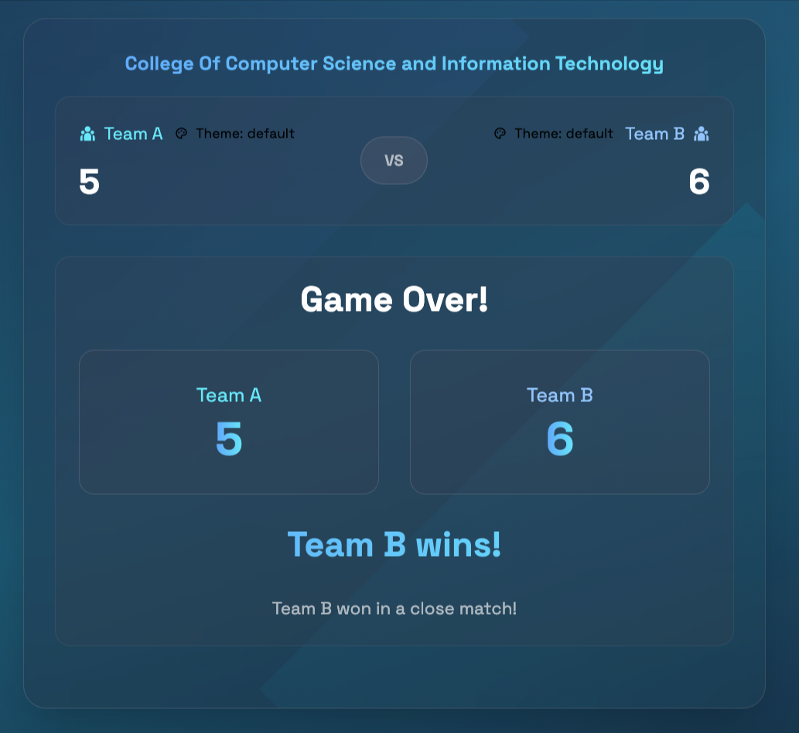

# Quiz App

## Overview
A modern, interactive quiz application built with Tailwind CSS and Vanilla JavaScript. This app provides an engaging platform for users to test their knowledge across various topics through customizable quizzes.

## Features
- **User-friendly Interface**: Clean and intuitive design for seamless navigation
- **Multiple Quiz Topics**: Diverse categories to choose from
- **Randomized Questions**: Different question order for each attempt
- **Score Tracking**: Real-time performance monitoring
- **Responsive Design**: Optimized for all devices (mobile, tablet, desktop)
- **Instant Feedback**: Learn from mistakes with immediate answer validation
- **Team-based Gameplay**: Supports two teams (Team A and Team B) competing against each other
- **Theme Customization**: Multiple visual themes available for each team (default, ocean, forest, sunset, purple, neon, ruby, midnight)

## Technologies Used
- **Tailwind CSS**: Utility-first CSS framework for rapid UI development
- **Vanilla JavaScript**: Pure JavaScript for efficient functionality
- **HTML5**: Modern markup for structure
- **CSS3**: Advanced styling capabilities
- **JSON**: Data storage for quiz questions

## Project Structure
```
├── assets/            # Static assets
│   └── screenshots/   # Application screenshots
├── build/             # Production build
│   ├── css/           # Compiled CSS
│   ├── data/          # Quiz data
│   └── script/        # Compiled JavaScript
├── src/               # Source files
└── tailwind.config.js # Tailwind configuration
```

## Team Functionality
The Quiz App features a competitive two-team mode:

- **Team A and Team B**: Teams take turns answering the same questions
- **Independent Scoring**: Each team's correct answers are tracked separately
- **Visual Differentiation**: Team-specific indicators show whose turn it is
- **Fair Competition**: Both teams see identical questions but can't see each other's answers until both have responded

## Theme Customization
Personalize the quiz experience with multiple visual themes:

- **Available Themes**: default, ocean, forest, sunset, purple, neon, ruby, midnight
- **Team-specific Themes**: Each team can have its own visual theme
- **Persistent Settings**: Team theme preferences are saved between sessions
- **Dynamic Switching**: Themes change automatically when teams alternate turns

## Setup
To run the Quiz App locally on your machine, follow these steps:

1. Clone the repository:
   ```
   git clone https://github.com/alaidi/quiz_app.git
   ```

2. Navigate to the project directory:
   ```
   cd quiz_app
   ```

3. Open the application in your browser:
   ```
   open build/index.html
   ```

4. Start taking quizzes and test your knowledge!

## Using Team and Theme Features
1. **Selecting Themes**:
   - Team themes are automatically loaded from browser storage if previously set
   - Default theme is applied if no theme was previously selected
   - To change themes, modify the theme selection in the settings menu

2. **Team Play**:
   - Team A always goes first for each question
   - After Team A selects an answer, the interface automatically switches to Team B
   - Scores are updated after both teams have answered
   - The game automatically advances to the next question

## Screenshots




## Contributing
Contributions are welcome! Please feel free to submit issues or pull requests to:
- Suggest improvements
- Report bugs
- Add new features or quiz categories
- Enhance UI/UX

## License
This project is available for use under the MIT License.

## Copyright
© alaidi.net


